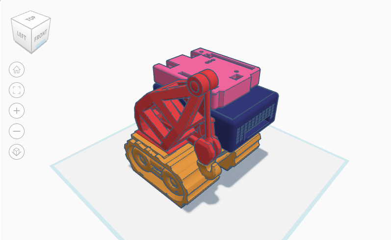
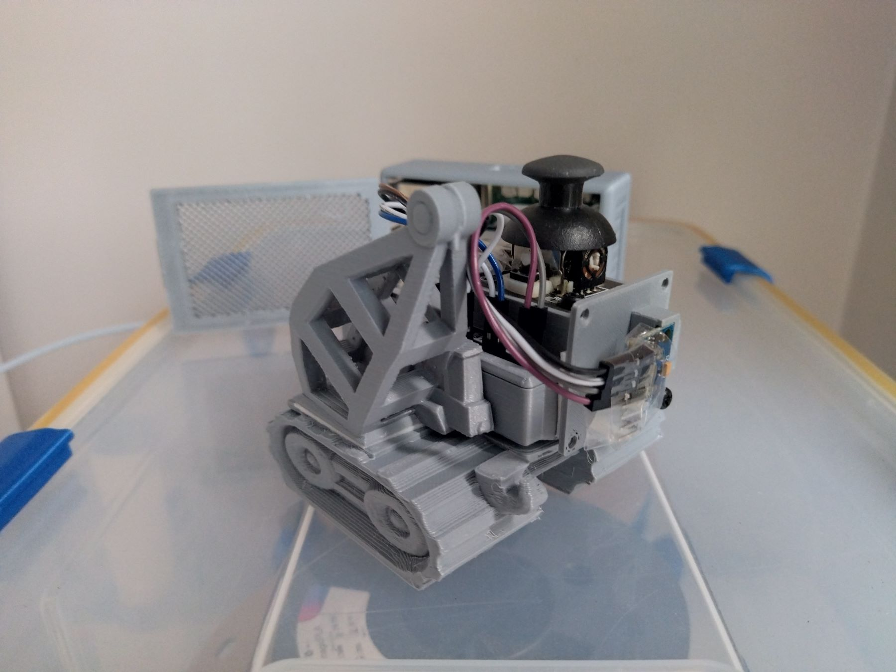

# Abstract
What's the efficient way of managing time series data for edge computing? Which measurements express efficiency overall? What technologies are available and how can we leverage their internal mechanisms to meet our needs? 
In this presentation I'm going to go through the technology evaluation step-by-step and showcase through a practical demo how to do an efficient analyisis before making a decision. We're looking at IoT and edge computing buillding blocks, then zooming in to different time series storage and analysis options, like for instance InfluxDB.

This presentation provides an in-depth view of the efficient time series data analysis in the context of edge computing and Internet of Things (IoT). It focuses on the challenges and solutions of managing and analyzing large-scale time series data in real-time. The presentation also explores current trends, methods, and potential advantages of employing time series analysis at the edge of the network, specifically for IoT applications. The ultimate goal is to improve data accuracy, reduce latency, enhance security and privacy, and optimize resource allocation for better decision-making processes in various IoT systems.




# Querying memory allocation from the OS
```shell
cat /proc/$(pgrep influxd)/status
pmap -px $(pgrep influxd)
ps -eo pid,vsz,rss,comm | grep influxd
```

# Recording
```shell
env LIBGL_ALWAYS_SOFTWARE=true obs
```

# Printing just line protocol
```shell
.venv/bin/python -u ./just_print.py | grep -v DEBUG
```

# Experiment Timeframes
## Latency
Preset time range for latency tests - 2024-09-27 07:55:49 -> 2024-09-27 08:10:49

## Throughput
SYNCHRONOUS/ASYNCHRONOUS/Batch 2024-09-27 13:53:05 -> 2024-09-27 14:01:11

# References
## Slides
- https://docs.google.com/presentation/d/16raJ8wr9D00qKgT_26fGRbnpJajOwEBHkEU76utnVOk/edit?usp=sharing
- [PDF format](./slides.pdf)

## Wear Leveling
- https://industrial.adata.com/en/technology/Wear-Leveling
- https://en.wikipedia.org/wiki/Wear_leveling

### Hardware
- https://www.aliexpress.com/item/1005006287642920.html

#### Raspberry Pi 64bit
- https://forums.raspberrypi.com/viewtopic.php?t=202487
- https://github.com/bamarni/pi64/blob/master/README.md

### InfluxDB 
- https://community.home-assistant.io/t/influxdb-with-grafana-on-sd-card/468258
- https://community.influxdata.com/t/what-options-do-i-have-to-help-reduce-io-on-an-embedded-system-with-sd-card/5926
- https://github.com/influxdata/influxdb/issues/23040

### Linux System Template
- https://github.com/influxdata/community-templates/tree/master/linux_system

### SQLite
- https://www.sqlite.org/lockingv3.html#rollback

### Micro SD
- [Micro SD card comparison](https://www.reddit.com/r/raspberry_pi/comments/xnkp71/reliability_of_microsd_endurance_cards_compared_w/)
- [Estimated write endurance without wear leveling](https://forums.raspberrypi.com/viewtopic.php?t=21281)

## AI Acceleration
- https://www.seeedstudio.com/blog/2024/07/16/raspberry-pi-ai-kit-vs-coral-usb-accelerator-vs-coral-m-2-accelerator-with-dual-edge-tpu/
- https://sbcnexus.com/articles/71202049/coral-tpu-vs-hailo-the-ultimate-showdown-for-edge-ai-dominance/

## Arduino development
- https://linuxhint.com/connect-arduino-nano-to-raspberry-pi/
- https://forum.arduino.cc/t/baud-rate-max-absolute/447715

## Joystick module
- https://arduinomodules.info/ky-023-joystick-dual-axis-module/
- https://github.com/timwaizenegger/raspberrypi-examples/blob/master/sensor-thumb-joystick/ky023.py

## 3D Designs
- https://www.thingiverse.com/thing:2583343
- https://www.thingiverse.com/thing:220585
- https://www.thingiverse.com/thing:994827/files

## Gyro sensor
- https://randomnerdtutorials.com/arduino-mpu-6050-accelerometer-gyroscope/
- https://mschoeffler.com/2017/10/05/tutorial-how-to-use-the-gy-521-module-mpu-6050-breakout-board-with-the-arduino-uno/

## Joystick
- https://arduinomodules.info/ky-023-joystick-dual-axis-module/

## Binary shrink
- https://github.com/influxdata/influxdb/issues/18866

## Profiling with `pmap`
- https://www.redhat.com/sysadmin/pmap-command

## Virtual Address Space - Wikipedia
- https://en.wikipedia.org/wiki/Virtual_address_space

## Technology Trends - Time Series
- https://db-engines.com/en/ranking/time+series+dbms